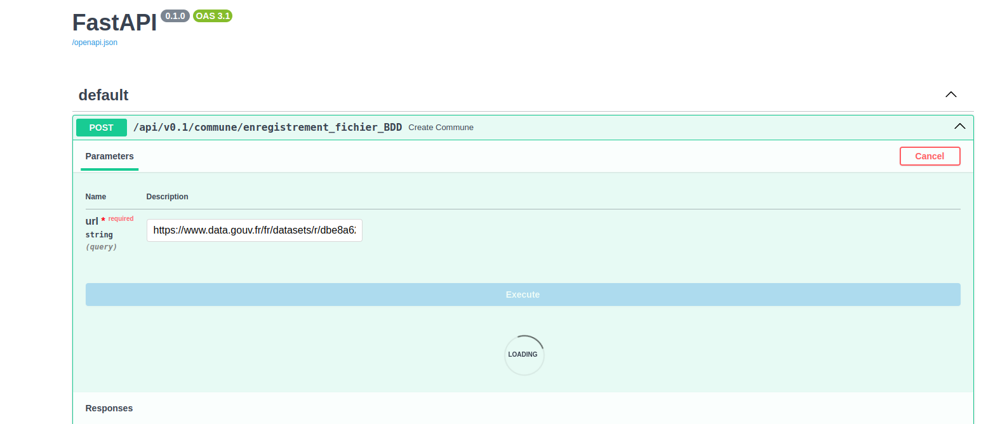
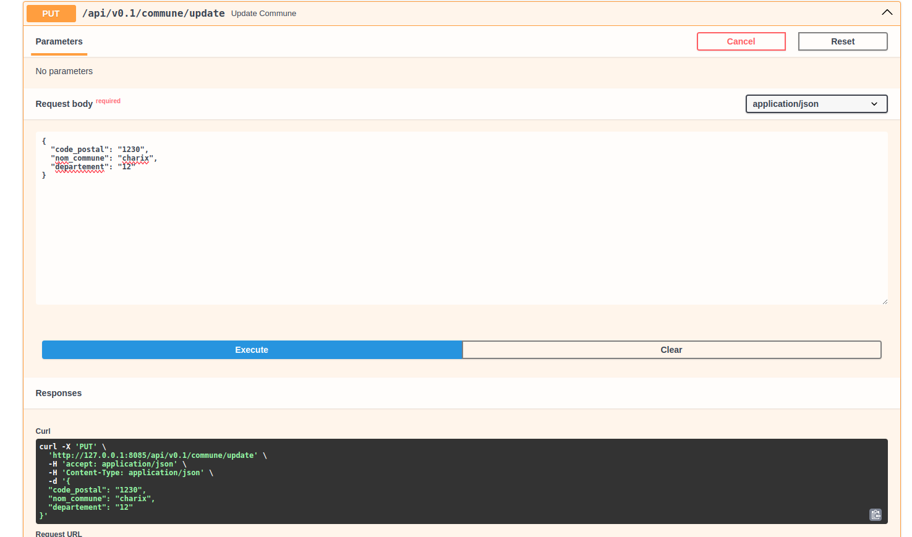
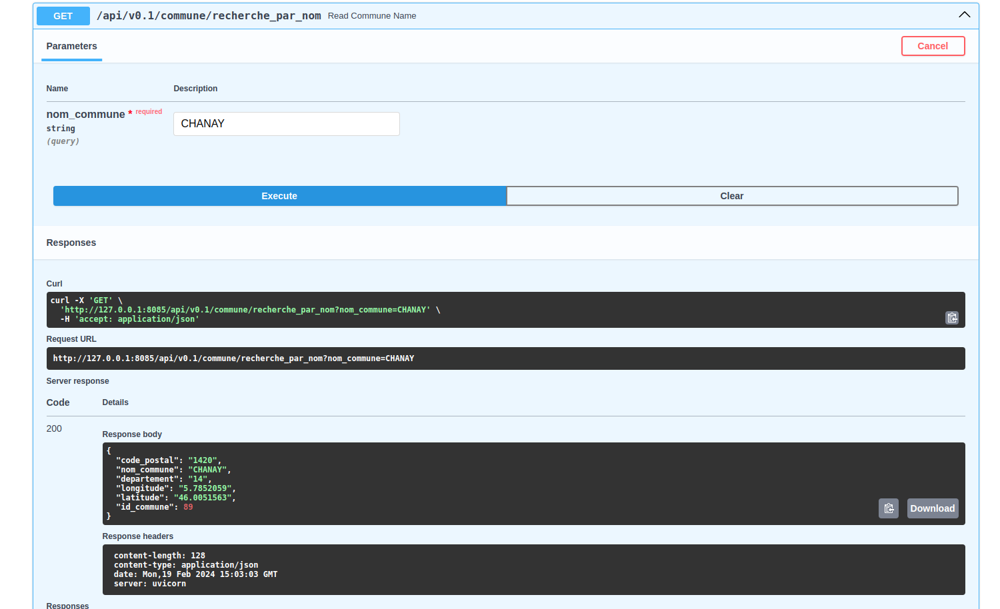
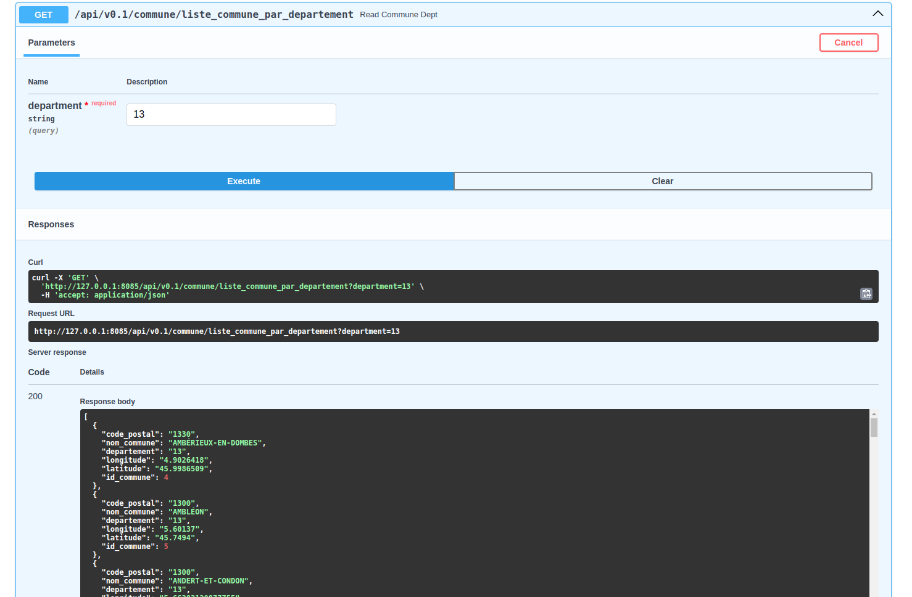
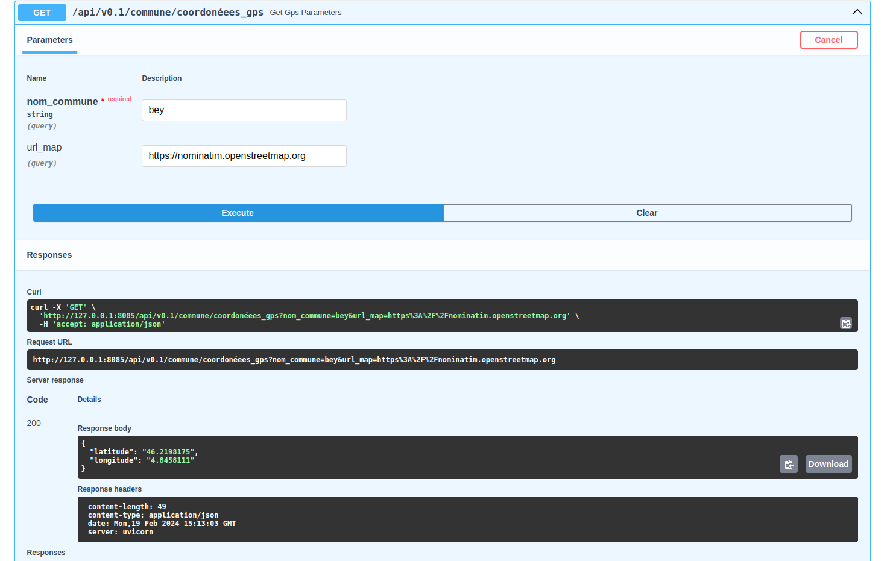
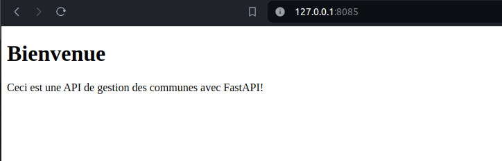
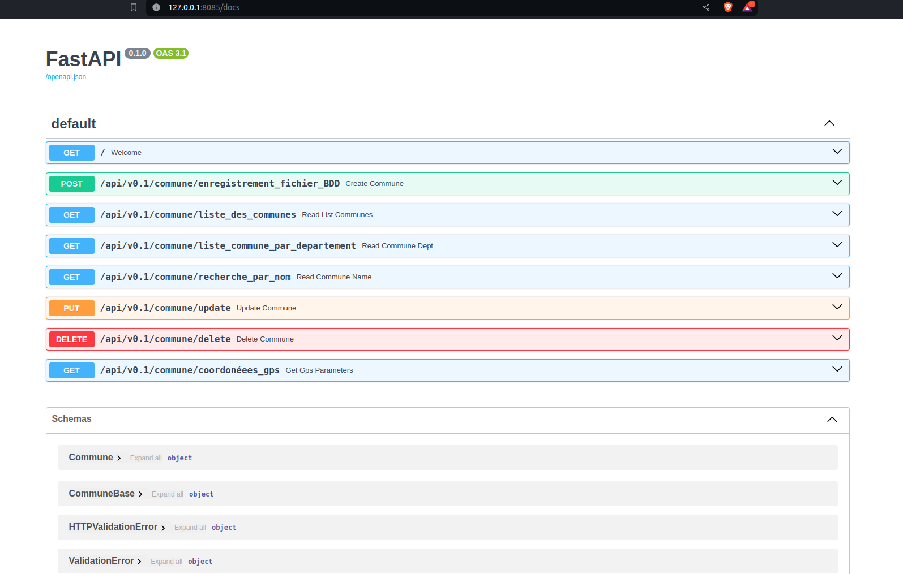

# Gestion des données des communes

L'idée du projet est de charger les données des communes dans une base de donné et de les interoger à travers fastapi, tout en tenant compte des contraintes imposées.
 

## Docker / Docker-compose:

· Un container avec FastAPI

```bash
    api-web:
        build: 
        context: ../../src
        image: api_commune:latest
        ports:
        - "8085:80"
        depends_on:
        - db
```

· Un container avec un gestionnaire de BDD au choix

```bash
    db:
        image: postgres
        restart: always
        shm_size: 128mb
        ports:
        - 5433:5432
        environment:
        - POSTGRES_PASSWORD=postgres
        - POSTGRES_USER=postgres
        - POSTGRES_DB=commune
        volumes:
        - ./data:/var/lib/postgresql/data

```

Importation et gestion des données :

· Envoie des données dans la base





## Méthodes du FastAPI 

· Pousser / Mettre à jour une commune, son code postal et son département dans ta BDD



· Récupérer les informations d'une commune sur la base de son nom




· Récupérer la liste de toutes les communes d'un département




· calcul les coordonnées GPS des communes. 




. mapper open-source dockerisé 

le mapper "nominatim" permet est un exemple de mapper dockerisé (il permet de retourner les coordonnées gps d'une commune )

```bash
    nominatim:
        container_name: nominatim
        image: mediagis/nominatim:4.3
        ports:
            - "8086:8080"
        environment:
            # see https://github.com/mediagis/nominatim-docker/tree/master/4.3#configuration for more options
            PBF_URL: https://download.geofabrik.de/europe/france-latest.osm.pbf
            #https://download.geofabrik.de/europe/monaco-latest.osm.pbf
            EPLICATION_URL: https://download.geofabrik.de/europe/france-updates/
            #https://download.geofabrik.de/europe/monaco-updates/
            NOMINATIM_PASSWORD: very_secure_password
        volumes:
        - nominatim-data:/var/lib/postgresql/14/main
        shm_size: 1gb
```


· Utilisation du git !

## Installation

1. Cloner le dépôt :

```bash
    git clone https://github.com/noumbissie/api_commune.git
```

2. Installer les dépendances :

```bash
    pip install -r requirements.txt
```


## Utilisation

1. Lancer l'application :

```bash
    docker compose build
    docker compose up

```
Vous devez avoir cette image d'acceuil !


Vous aurez egalement cette image dans la parti documentation de l'api



## Licence

Ce projet est sous licence [Apache](http://www.apache.org/licenses/).